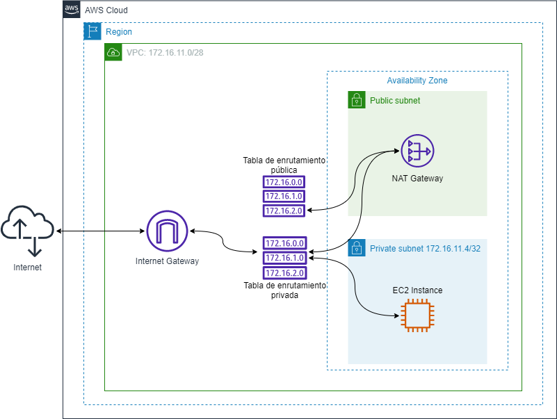
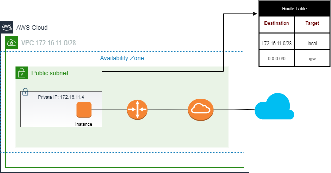
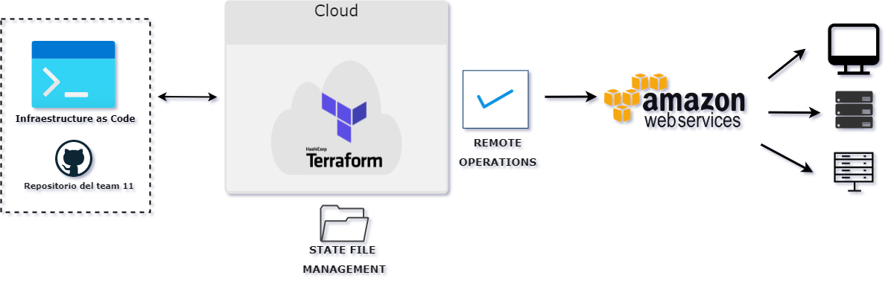
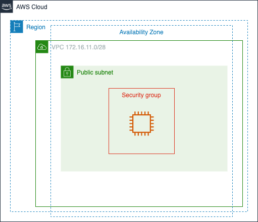

# Desafio IV : Proof of Concept | Redes de Informacion 
Desarrollo de una PoC, utilizando workflow ya hecho que utiliza una API KEY, una organización y un workspace de Terraform Cloud
#### Se encuentra desactivado github actions p
## Amazon Virtual Private Cloud (VPC)
### Definir y lanzar recursos de AWS en una red virtual aislada lógicamente

Incialmente al conocer sobre los recursos de AWS y las Virtual Private Cloud planteamos un esquema como este:

La VPC desarrollada en el laboratorio solo cuenta con subnet publica, instancia de AWS e internet gateway. El esquema utilizado lo representamos a continuacion: 

## Infraestructure as Code
### Terraform Cloud
Terraform Cloud nos permite eliminar algunos pasos y documentacion para usar Terraform en ambientes de produccion, desplegar instancias. 
 
 
 La estructura del repositorio de codigo para esta infraestructura contiene los siguientes files con extension .tf y un .yml para desplegar la instancia usando terraform y github actions:
 
### -  .github
      /workflows
        /terraform.yml
   
###  - instance.tf
   
   En este file indicamos la private ip que le dio el grupo a la instancia y pusimos sus tags

### - networking.tf
    
   Este file tambien fue modificado por nosotros, indicando el bloque CDIR de la vpc del grupo. Ademas podemos ver las configuraciones de la tabla de enrutamiento donde vemos que tenemos tambien un internet gateway

### - output.tf

### - provider.tf 

### - user-data.sh

### - variables.tf 

### - security_groups.tf
   En este file se configuro un grupo de seguridad, con dos reglas ingress para HTTP y SSH. A continuacion lo mostramos en este esquema y tabla:
 

* some title

  <table>
    <thead>
      <tr>
        <th>Tipo</th>
        <th>Protocolo</th>
        <th>Intervalo de puertos </th>
        <th>Origen </th>
      </tr>
    </thead>
    <tbody>
        <tr>
            <td> HTTP </td>
            <td> TCP </td>
            <td><code> 80 </code></td>
            <td><code> 0.0.0.0/0 </code></td>
        </tr>
        <tr>
            <td>" SSH </td>
            <td> TCP </td>
            <td><code>22</code></td>
            <td><code>0.0.0.0/0</code></td>
        </tr>
    </tbody>
  </table>
